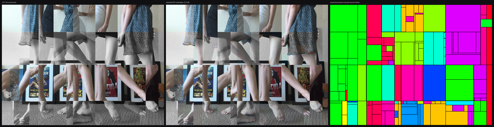
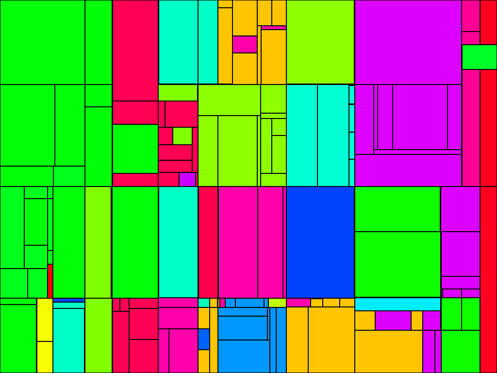
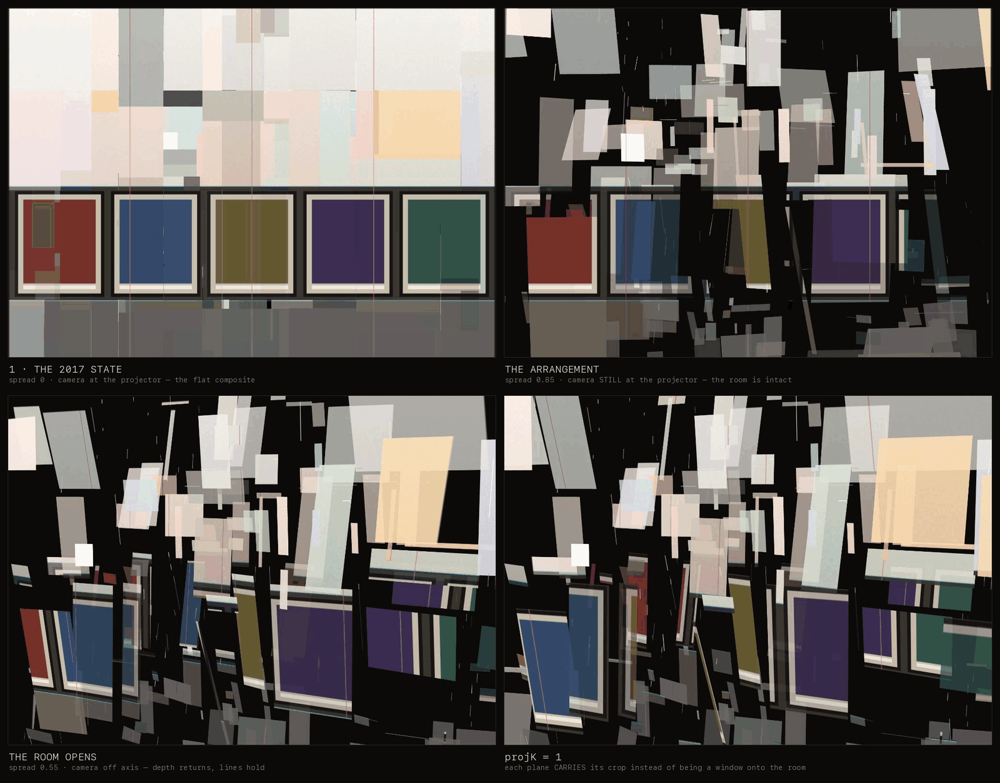

# danse

A room that never repeats, built from one afternoon.

On **20 June 2017**, 161 photographs of a dancer were made in a single session — an
apartment room with a row of framed classic-horror posters standing against the wall,
carpet, a guitar. The camera barely moved. On **25 July 2017** three of those frames
were cut apart by hand and recomposed into a tiled composite: fragments of her, at
different scales and opacities, over one continuous room.

Then it sat for nine years.

This is the machine that does it now — and doesn't stop.

## What it is

A seeded generative engine. Photographs hang as translucent planes at different depths
and angles in a 3D room; the engine selects fragments — anatomy, not rectangles — from
different frames of that afternoon and composes them. It never repeats, and every state
it can reach has a number.

Five faces, one engine:

| Face | What it is |
|---|---|
| **The river** | The work itself: the engine running, unbounded, never the same water. |
| **The passage** | One traversal of the declared phrase, with its own seed and its own length. |
| **The capture** | A recording of the river. Named by the passage it caught, never mistaken for the piece. |
| **The visitor** | Their own river, minted on arrival, kept, and shareable. |
| **The room** | The same engine driving real projectors onto real hanging scrim. |

### Final Evolution

1. **User Interaction**: Direct interaction (via MediaPipe pose querying, body input, and visitor modulation in the space).
2. **Spatial Sound Triggering**: Sound derived from the room/space that each generation of panel/slice triggers between the background's XY axes as material assembles and moves.

## Arriving is the seed

The piece has no duration and no end. It traverses a declared **phrase** forever, and each
traversal is a **passage** with its own seed, its own material and its own length — so a
passage that has gone by does not come back.

That makes the *piece* unrepeatable. What makes a *visit* unrepeatable is `arrival.js`: a
visitor's river is two numbers made by the act of showing up.

```
seed    a draw from the platform CSPRNG, mixed with the epoch
epoch   the wall-clock millisecond it was drawn

t = (now − epoch) / 1000      the river has been flowing since it began
```

Time only moves one way, so a returning visitor rejoins **downstream** and never at the
source: close the tab, come back in an hour, and your river ran for that hour without you.
The river is kept in `localStorage` under `danse.river`, so it is *yours* across visits —
what does not repeat is the water, not the riverbed.

Two links, and they are different objects:

| Link | What it hands over |
|---|---|
| `#s=<seed>&e=<epoch>` | **Your river**, live and still flowing. The recipient lands in the same water at the same instant, having exchanged nothing with you but those two numbers. |
| `#s=<seed>&t=<seconds>` | **One moment**, cited. The frame that reproduces exactly what you saw, wherever it is opened. |
| `#s=<seed>` | A river named by seed alone — no birthday, so it starts at its source. `#s=20170620` is the archival one. |
| `#p=free` | The older free-running dwell cycle, which `verify.html` pins the 2017 reproduction to. |

The address bar is written once a second and deliberately **never** carries `t`: persisting
it would make a reload resume where you left, which is a loop wearing a river's clothes.

`arrival.js` is the only file in the app permitted to read a clock or draw entropy, and both
halves of that are checked — `check-danse.py` fails if either appears inside `engine/`, and
also if either appears anywhere else in the app. The engine stays a pure `f(seed, t)`;
uniqueness costs it nothing.

## The three decisions

**Projective texturing, not per-plane UVs.** Every photograph is registered to one room
frame, and every fragment samples through a shared room-projector matrix. Two planes at
different depths and angles therefore place the floor line and the poster line on the
*same screen-space lines* — the continuity is a property of how pixels are fetched, not
a rule the generator has to remember.

**Two independent axes, not one.** The still opens into a room along *geometry* — planes
leaving the picture plane for angles and depths — and along `projK`, one uniform mixing
plane-local UVs against projector UVs. `projK = 0` makes a plane a **window**: it shows
whatever the room casts onto wherever it now is, so its content changes as it moves.
`projK = 1` makes it a **carried picture**: it holds its assigned crop and takes it
along. At the home position the two are *numerically identical*, which is why the 2017
composite is ambiguous between collage and room — and why the flattening is really the
**camera**, not `projK`. Stand where the camera stood and the composite returns no matter
what the planes are doing.

**The engine is a pure `f(seed, t)`.** No accumulated state, no `requestAnimationFrame`
inside `engine/`. That single property buys deterministic film renders, O(1) seek,
shareable permalinks, and multi-projector sync for free.

## What the corpus turned out to be

Measured, not assumed — and it changed the design:

- **161 of 162 frames carry a person matte** at 11–18% coverage, quality 0.987–0.998.
- **Body-pose detection finds joints in only 65**, and never reaches 8 confident ones.
  The histogram says why: knees 40%, ankles 37%, hips 35% — then shoulders 3%, faces 2%.
  **The shoot frames legs.** There is no upper body for a whole-person model to anchor on.
- So the **matte is the primary instrument** and pose is an optional refinement. Gating
  on pose would have thrown away 60% of a corpus in which the subject is unmistakably
  present.
- **The camera is locked off.** The poster row sits at identical pixel coordinates across
  frames, which makes registration nearly free and is exactly why the 2017 hand-cuts
  aligned so cleanly.
- **The 2017 composite is registered to the room to within 0.4% of frame height.** Its
  horizontal seams (0.4622, 0.4857) land on the poster-rail transition measured
  independently from the one dancer-free frame (0.4661, 0.4886). The artist's own rule
  was *cut on the architecture* — so the engine derives its bands from the room rather
  than inventing a grid.

## The 2017 piece, solved

Before evolving it, recreate it. Stage 3 does not approximate the composite — it **solves
it back into a score**: which of the 162 frames each region was cut from, and what
treatment was applied. The model per rectangle is

```
C  =  gain · S  +  lift          (per colour channel, least squares)
```

which is not merely noise-tolerant. Normal-blending a photograph over a light ground at
opacity `a` is exactly `gain = a, lift = (1-a)·ground`, and desaturating is exactly a
per-channel spread in gain. Several tiles come back at `gain ≈ 0.64, lift ≈ 0.36` — pairs
summing to 1.0. The solver was never told about opacity; it fitted a line, and the line
came back as the 2017 hand-treatment in the two numbers a shader takes.

**The result** — [`corpus/score-2017.json`](corpus/score-2017.json), 256 rectangles,
**32.3 dB PSNR**, mean absolute error 0.015:

| rectangles | 32 | 64 | 128 | 256 | 384 | 512 |
|---|---|---|---|---|---|---|
| **PSNR (dB)** | 25.98 | 29.29 | 31.18 | 32.27 | 33.11 | 33.59 |
| **frames used** | 21 | 34 | 48 | 77 | 90 | 110 |

Reading the curve: the piece is *about a hundred rectangles* — past that, fidelity is
bought a fifth of a dB at a time. Which is a statement about how much grammar the engine
actually needs.



*Left, the 2017 composite as it was cut by hand. Centre, the same picture re-derived from
the 162 originals by the solver at 256 rectangles — 32.3 dB. Right, where each region came
from. The middle panel is not a filter applied to the left one: every pixel in it was
fetched from a photograph and placed by a number.*

What the solve found:

- **77 of 256 rectangles need two source layers**, at a 15% error-reduction threshold.
  The composite is not a mosaic of opaque tiles; roughly a third of its area is two
  photographs superimposed, and a one-source model produces *diagonal* residual ridges
  where a translucent limb crosses the frame beneath it.
- **77 distinct frames of 162 are in play** — but the distribution is steep. `IMG_1611`
  alone accounts for 17.5% of the picture and `IMG_1615` another 14.3%.
- **The major horizontal band edges land at 0.500 and 0.799** of frame height. Stage 2's
  independent seam measurement of the same composite said 0.486 and 0.802, and the room's
  own poster rail — measured on the one dancer-free frame — sits at 0.489. Three
  measurements, three methods, one architecture.



*The provenance map: one hue per source frame. This is the piece's genome — which instant
of that afternoon each region was drawn from. It is also the fastest correctness check
available: a real solve reads as flat contiguous plates, a failed one reads as noise.*

## The projection holds — go/no-go

One claim carries the design: that photographs hung on planes at unrelated angles and
depths still read as **one room**, because every fragment fetches pixels through a single
shared projector matrix instead of through its own surface. If it were false, the piece
would be a pile of floating cutouts and the architecture would have to change before
anything else was built — so [`probe.html`](probe.html) tests it first, against the real
256-rectangle score rather than a toy.

The projector stands where the camera stood on 20 June 2017, and casts a stand-in plate
carrying the room's measured horizontals (0.489 and 0.802). Those two lines *are* the
experiment: if they stay straight across 256 tumbling rectangles, the claim holds.



Three results:

- **The self-test is exact.** A tile's rect is precisely its share of the projector
  frustum, so at the home position the window path and the carried-picture path must
  resolve to the same texel. Sweeping `projK` across all 256 tiles changes **max Δ 0/255**
  — bit-identical, not merely within tolerance. The home state is the 2017 composite by
  construction, not by tuning.
- **Continuity survives arbitrary geometry.** At `spread = 0.85` the planes tumble through
  depth and rotation, and the poster rail is still one straight line crossing every one of
  them, verticals still plumb, posters still at true scale and registration.
- **The flattening is the camera.** With the arrangement fully exploded, standing at the
  projector still returns the flat composite — projective texturing looks painted-on from
  the projector's own viewpoint. So the reveal needs no geometry animation at all: *walking
  away from where the photograph was taken is what un-flattens it.*

That third result is the piece. It also fixes the film's dramaturgy: the arrangement can be
built up invisibly while the camera is on-axis, and revealed by a move rather than a cut.

## Three grammars, one operation

The transmutation practice this engine generalises is older and wider than the ballet
piece. Analytic cubism's actual move is not angular shapes, it is **simultaneity**:
several viewpoints of one subject coexisting in one picture plane. The 2017 works are
three cut-geometries over that identical operation —

| Work | Corpus | Cut |
|---|---|---|
| **danse** | 162 frames, one locked-off room | rectangular grid, aligned to the room's architecture |
| **noonlight** | 21 frames, one face turning | polygonal shards with white kerf, over sky |
| **b/w remix** | supplied frames, one face | staggered bands keyed to anatomy — eyes, lips, hair, arm |

Different scissors, same cut. So `engine/grammar.js` carries a **cut vocabulary** rather
than a hard-coded grid, and the seed chooses among the geometries.

And this is why the room is not decoration. Picasso flattened his viewpoints into the
picture plane because a canvas has no depth to hang them in. Screens at different angles,
depths and transparencies put them back. `projK = 1` is literally that flattening;
animating it toward `0` is literally its undoing.

## Layout

```
apps/danse/
  index.html   the living page          film.html    capture harness (no UI, no rAF)
  arrival.js   the ONE impure module — a visitor's river, and the only clock
  studio.html  seed browser             join.html    visitor upload
  probe.html   the projection go/no-go, with its self-test
  engine/      gl · mat4 · rng · room · grammar · renderer · corpus · clock · program
  corpus/      score-2017.json · manifest.json · plates/ · masks/
  pipeline/    corpus preparation (local only, never deployed)
  render/      deterministic offline renderer (local only, never deployed)
```

## Pipeline

Runs on this machine, against Photos.app. Originals never enter git — `.work/` is
ignored, and only the code that regenerates everything is versioned.

```bash
cd apps/danse/pipeline
./0_export.sh                      # Photos ▸ etcetera ▸ ballerina danse ▸ danse → .work/raw
./1_vision/build.sh                # dependency-free Swift + Vision.framework
./1_vision/danse-vision .work/raw .work/vision
python3 2_measure_transmutation.py .work/reference/T-2017-full.png \
        --room-frame .work/raw/IMG_1570.JPG -o .work/reference/transmutations.json
python3 3_reconstruct.py --target .work/reference/T-2017-full.png \
        --frames .work/raw --depth 2 --leaves 256 -o .work/reference/score-danse.json
python3 3_reconstruct.py ... --sweep 32,64,128,256,384,512   # rate/distortion curve
```

## Provenance

Nothing is synthesised. Every pixel is a photograph taken on 20 June 2017. The pose
model is a measuring instrument — it locates a knee; it does not draw one. There is no
diffusion, no training on anyone else's work, and no synthetic frame anywhere in this
project.

## Run

Pure static — no build step, no dependencies.

```bash
cd apps/danse && python3 -m http.server 8080
```

Plan: [`docs/plans/2026-07-30-danse-generative-engine.md`](../../docs/plans/2026-07-30-danse-generative-engine.md)
