# VIGILIA — The Hierarchy (org chart)

Addendum to [`CHARTER.md`](./CHARTER.md). The institution rendered as a business org:
the **C-suite** (actors), the **departments** that pour out of each (organs), the
**structural domains/surfaces** each officer owns (its real estate), and the
**entrances & exits** (ingress/egress — the doors in and out of each building).

> Officers map to the body's needs, not to people. One officer can be mostly-built,
> missing, or solved — see `registry/organs.yaml` for each one's status + residual.

## Org chart

```mermaid
flowchart TD
    BOARD["🪑 BOARD — Anthony (the Operator)<br/>reserved levers: send · wipe · spend · mass-merge · deploy 'ship it' · name-ratify"]
    CEO["👑 CEO — THE HEARTBEAT<br/>limen conductor · heartbeat-loop.sh<br/>convenes the officers each beat"]
    BOARD --> CEO

    CEO --> CFO["💰 CFO — VITALS & BUDGET<br/>'don't crash'"]
    CEO --> CISO["🛡️ CISO — IDENTITY·AUTHORITY·INTEGRITY<br/>'don't break · stop asking · don't self-corrupt'"]
    CEO --> CKO["🧠 CKO — CONTINUITY & MEMORY<br/>'don't forget'  ⚠ failed this session"]
    CEO --> CTO["🧬 CTO — ARCHITECTURE & GENOME<br/>the spine · the '100×'"]
    CEO --> COO["⚙️ COO — OPERATIONS / THE ARMS<br/>'get the work done' (somatic — indexed, not absorbed)"]
    CEO --> GC["⚖️ GENERAL COUNSEL / CHIEF AUDITOR<br/>judiciary + proprioception (independent oversight)"]
    CEO --> CCO["🪟 CCO — THE FACE<br/>operator-facing pane"]

    CFO --> v1["_diagnostics: sysdiag · memdiag · mem-pressure-snapshot (SENSE)"]
    CFO --> v2["VITALS executive  ⛔ to build (#1)"]
    CFO --> v3["usage-telemetry.py · autonomy-governor.py"]

    CISO --> i1["creds-hydrate.py + ~/.limen.env (identity)"]
    CISO --> i2["~/.claude settings + hooks (authority)"]
    CISO --> i3["autoupdater/signature governance (integrity)"]

    CKO --> c1["session-meta"]
    CKO --> c2["corpus feed · claude_projects.py"]
    CKO --> c3["transcript store ~/.claude/projects · memory/"]

    CTO --> t1["parameter panel · governance/parameters.yaml"]
    CTO --> t2["INDEX·NOMINVM · nomenclator.py"]
    CTO --> t3["the seat · registry/organs.yaml"]
    CTO --> t4["no-hardcodes CI gate  ⛔ to build (#3)"]

    COO --> o1["dispatch.py lanes"]
    COO --> o2["vendor fleet: claude·gemini·codex·jules·opencode·agy·copilot"]
    COO --> o3["merge-policy.sh"]

    GC --> g1["_diagnostics/inquiry (six-lens) · assessments · precedents"]
    GC --> g2["organ-health.py · watchdog.py"]
    GC --> g3["the Censor (insights→actions)"]

    CCO --> f1["tui / portus"]
    CCO --> f2["web dashboard · web/app"]
```

## The buildings — domains, entrances, exits

Each officer owns a **domain** (its real estate). **Entrances** are how state/work gets
*in* (sensors, triggers, inputs); **exits** are how the officer *acts* on the world (outputs,
actions, alerts).

| Officer | Mandate | Domain / surfaces | Entrances (ingress) | Exits (egress) |
|---|---|---|---|---|
| **CEO — Heartbeat** | run the beat | `heartbeat-loop.sh`, `metabolize.sh`, launchd `com.limen.heartbeat` | the tick (timer); connectivity gate (#224); autonomy mode | convenes officers each beat; voice-stamps |
| **CFO — Vitals & Budget** | don't crash | `_diagnostics` sensors; VITALS executive ⛔; `usage-telemetry.py`; `autonomy-governor.py` | `kern.memorystatus_vm_pressure_level`, `vm_stat`, per-vendor usage, the beat | throttle dispatch ceiling; shed load (pause lanes / stop ollama); `logs/usage.json` |
| **CISO — Identity·Authority·Integrity** | don't break / stop asking / don't self-corrupt | `creds-hydrate.py` + `~/.limen.env`; `~/.claude/settings.json` + hooks; signature/autoupdater governance | 1Password (`op://`), launchd login, Gatekeeper/TCC events, `codesign --verify` | hydrated env → all tools; auto-approved permissions; pinned/verified binaries; drift alerts |
| **CKO — Continuity & Memory** ⚠ | don't forget | `session-meta`; corpus feed `claude_projects.py`; `~/.claude/projects` transcripts; `memory/` | session `*.jsonl`, `/compact` summaries, subagent outputs, queued/interrupt prompts | reconstructed thread on degenerate handoff (`CONTINUITY_MIN_SUMMARY_CHARS`); corpus atoms; memory writes |
| **CTO — Architecture & Genome** | every name/path/threshold = a param | `governance/parameters.yaml`; `nomenclator.py`; `registry/organs.yaml`; no-hardcodes gate ⛔ | declared params; name-gate checks; PR CI | one config surface; build-fail on hardcode/bad-name; the legible registry |
| **COO — Operations / Arms** | get the work done | `dispatch.py` lanes; vendor fleet; `merge-policy.sh` | `tasks.yaml` queue; PR queue; vendor reset cadences | PRs, merges, deploys, shipped product |
| **General Counsel / Auditor** | tell the truth; record precedent | `_diagnostics/inquiry`; `organ-health.py`; `watchdog.py`; the Censor | voice-stamps; artifact probes; daemon liveness | `organ-health.json/html`; watchdog alerts + self-heal; precedents; `needs_human` digest |
| **CCO — The Face** | one pane to see & steer | `tui`/`portus`; `web/app` dashboard | the seat (`organs.yaml`) + `organ-health.json` | the operator-facing pane |

## The board's reserved powers (human-gated levers)

These never delegate to an officer — they stay with the operator:
**send** (email) · **wipe/delete** · **large spend** · **mass cross-org/fleet merge** ·
**deploy "ship it"** (for human-gated deploys) · **name ratification** (INDEX·NOMINVM).

## Reading the chart against today

- **CFO** had the diagnosis (FIND-005) but no executive → **08:47 kernel panic**.
- **CKO** had no auto-reconstruction → **~13:42 the session thread was lost** (200-char stub).
- **CISO** had the lever (`DISABLE_AUTOUPDATER`) but didn't govern it → **the corrupt-app dialog**.

Three officers with a mandate and no hand. Building #1 gives the autonomic officers their hands.
